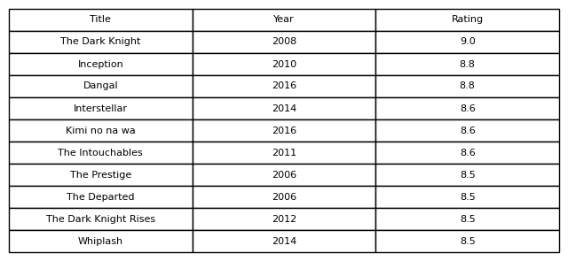

# IMDb Top 1000 Movies – SQL-Analyse

Dieses Projekt zeigt, wie man mit SQL eine realitätsnahe Film‑Datenbank analysiert. Ausgehend vom [IMDb‑Top‑1000‑Datensatz](../data/IMDB-Movie-Data.csv) wurde eine normalisierte SQLite-Datenbank erstellt, verschiedene Abfragen entwickelt und die Ergebnisse mit Python automatisiert exportiert.

## Projektüberblick

* **Datenaufbereitung:** Import der CSV in eine SQLite-Datenbank und Aufteilung in separate Tabellen für Filme, Genres und Regisseure.
* **SQL-Abfragen:** 11 unterschiedliche Abfragen mit GROUP BY, JOINS und Window Functions.
* **Automatisierung:** Ein Python‑Skript (`../scripts/analysis_script.py`) erstellt die Datenbank, führt alle Abfragen aus und speichert Ergebnisse als CSV sowie Screenshots der wichtigsten Tabellen.
* **Dokumentation:** Dieses README fasst das Vorgehen zusammen und hebt zentrale Erkenntnisse hervor.

## Struktur

| Ordner           | Inhalt                                                     |
|------------------|------------------------------------------------------------|
| `/data`          | Originaldatensatz (CSV)                                    |
| `/database`      | SQLite‑Datei mit normalisierten Tabellen (`imdb_top1000.db`) |
| `/sql_queries`   | Alle SQL‑Abfragen als einzelne `.sql`‑Dateien              |
| `/query_results` | Exportierte `.csv`‑Dateien und Screenshots zu den Ergebnissen |
| `/scripts`       | Automatisiertes Python‑Skript zur Erstellung/Analyse       |
| `/docs`          | Dokumentation (README, optional PDF)                       |

## Wichtige Erkenntnisse

* **Beliebteste Genres:** Drama ist das am häufigsten vertretene Genre, gefolgt von Action und Comedy. Obwohl Drama quantitativ dominiert, weisen Sci‑Fi‑Filme im Schnitt die besten Bewertungen auf.
* **Top‑Filme pro Jahr:** Mithilfe einer Window Function lässt sich der jeweils höchstbewertete Film pro Erscheinungsjahr ermitteln.
* **Bewertungen nach Jahrzehnten:** Die Durchschnittsbewertung steigt von den 1970er‑ zu den 1990er‑Jahren und sinkt in den 2010er‑Jahren leicht.
* **Einnahmen:** Ein Ranking nach Umsatz zeigt, dass Blockbuster aus den 2000er‑ und 2010er‑Jahren die höchsten Einnahmen erzielen.

## Beispiel‑Screenshots

Um Lesern einen schnellen Einblick zu geben, kannst du Screenshots der wichtigsten Tabellen einbinden. Hier zwei Beispiele:

*Abb. 1: Top 10 der höchstbewerteten Filme anhand des IMDb‑Ratings.*

*Abb. 2: Durchschnittliche Bewertung pro Genre (nur Genres mit mindestens 5 Filmen).* 

## Nutzung

1. Lade das Repository herunter und installiere die benötigten Python‑Bibliotheken (`pandas`, `sqlite3`, `matplotlib`).
2. Führe das Skript `../scripts/analysis_script.py` aus. Es lädt den Datensatz, baut die Datenbank, führt alle SQL‑Abfragen aus und legt die Ergebnisse im Ordner `query_results` ab.
3. Sieh dir die erzeugten CSV‑Dateien und die Screenshots an oder passe die Abfragen nach Bedarf an.

## Fazit

Die Analyse zeigt, dass schon mit einer vergleichsweise kleinen Datenbank spannende Einblicke in Filmgenres, Bewertungen und Einnahmen möglich sind. Durch die Normalisierung der Daten und den Einsatz von SQL‑Features wie Window Functions wird das Projekt zu einem überzeugenden Beispiel für professionelle Datenbankanalyse.
